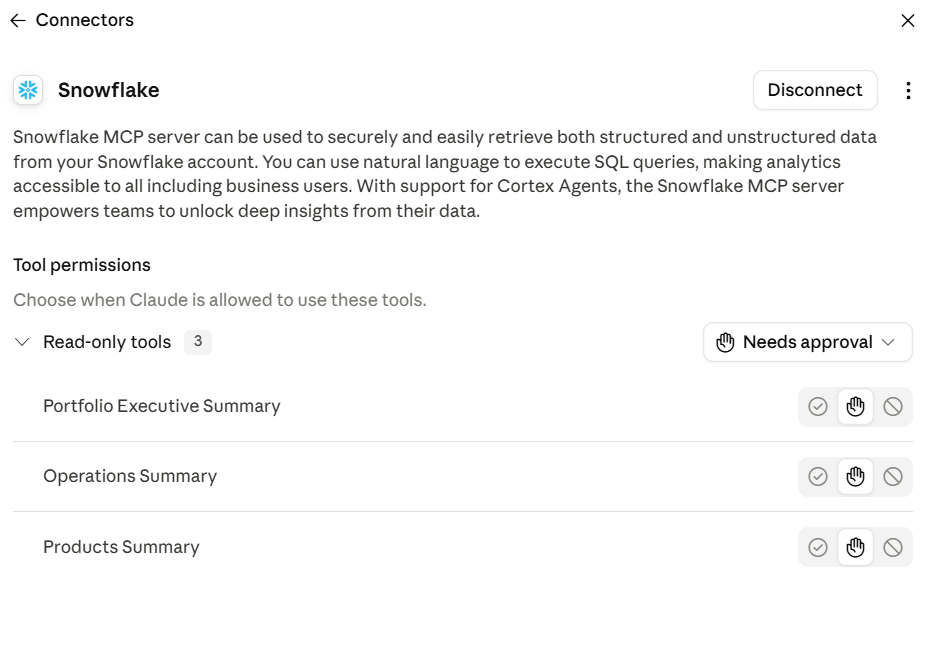
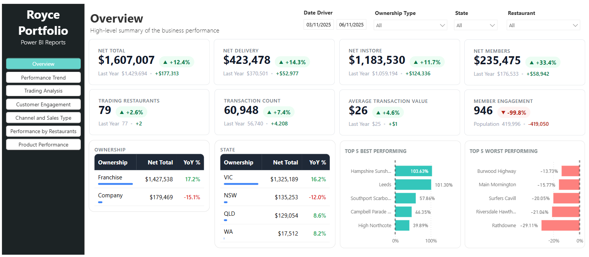

# Royce Tabora — Data & Analytics Portfolio

**End-to-end data engineering and analytics platform**, built to demonstrate how raw operational data becomes governed, trusted business intelligence — from ingestion through to AI-powered natural language querying.

Built on **AWS · Snowflake · dbt · Power BI · Snowflake Cortex · Streamlit**, this project simulates a real restaurant/retail business (multi-store sales, membership, inventory, labour, and supplier data) and takes it through the full modern data stack lifecycle.

📊 **[Browse sample dashboards & screenshots →](./CLICK_ME_FOR_PORTFOLIO)**

---

## Why this project

I built this to showcase, hands-on, the same responsibilities I own professionally as a BI Specialist: designing cloud data platforms, modelling data for governed self-service reporting, and layering AI-native tooling (Cortex, MCP, Claude) on top so business users can ask questions in plain English instead of writing SQL.

---

## Architecture

```
AWS S3  →  Snowflake (RAW)  →  dbt (Staging → Marts)  →  Snowflake Semantic Views
                                                              ├── Power BI dashboards
                                                              ├── Streamlit executive app
                                                              └── Cortex Analyst / Claude (MCP, natural-language querying)
```

**Flow:**
1. Raw operational data (sales, products, members, restaurants, reviews, holidays) lands in **AWS S3**
2. Data is securely ingested into **Snowflake** via external stages and file formats
3. **dbt** transforms raw data through staging → dimensional models → fact/dimension marts
4. **Snowflake semantic views** describe the marts in business terms for governed self-service
5. Curated data is exposed through **Power BI** dashboards, a **Streamlit** executive reporting app, and **AI-driven natural-language querying** via Snowflake Cortex Analyst and Claude (MCP)

---

## Tech Stack

| Layer | Tools |
|---|---|
| Storage / Ingestion | AWS S3, Snowflake external stages, file formats |
| Warehouse | Snowflake (databases, schemas, warehouses, roles, access control) |
| Transformation | dbt (staging, marts, tests, docs, Git integration) |
| Semantic Layer | Snowflake Semantic Views (Cortex Analyst-ready) |
| AI / NLQ | Snowflake Cortex, Claude, MCP (Model Context Protocol) |
| BI / Reporting | Power BI, Streamlit |
| Sentiment Analysis | Python |

---

## Repository Structure

```
├── SNOWFLAKE_CONFIG_AND_DBT_ACTIONS/   # Snowflake setup: roles, schemas, ingestion, semantic YAMLs
│   ├── 1_CONFIGURATIONS_BEFORE_STARTING/
│   ├── 2_DATA_INGESTION_SETUP/
│   ├── 3_DATA_LOAD/
│   └── 4_SEMANTIC_YAML/
├── ROYCE_DBT_PROJECT/                  # dbt project — staging, marts, macros, tests
│   └── models/
│       ├── STAGING/
│       ├── MARTS/                      # fact & dimension tables, sentiment analysis
│       └── SEMANTIC/
├── EXECUTIVE_REPORT_STREAMLIT/         # Streamlit executive reporting app
├── DEV_ARTIFACTS/                      # Power BI template, sample gold-layer dataset
└── CLICK_ME_FOR_PORTFOLIO/             # Sample screenshots of dashboards & AI integrations
```

---

## What's Inside

### Data Modelling (dbt)
Fact and dimension tables covering restaurant operations, sales, inventory, labour, supplier performance, and customer membership — including `OPS_FACT_RESTAURANT_OPERATIONS_DAILY`, `OPS_FACT_INVENTORY_PERFORMANCE_DAILY`, `OPS_FACT_SUPPLIER_DELIVERY_PERFORMANCE`, and `PY_FACT_CUSTOMER_REVIEWS_SENTIMENT`.

### AI-Native Analytics
- Snowflake Cortex-powered customer review sentiment analysis
- Semantic views built for Cortex Analyst, enabling natural-language questions over the data
- MCP integration connecting Claude directly to the Snowflake semantic layer



### Power BI Dashboards
Built: Overview, Performance Trend, and Trading Time Analysis.
Planned: Member Engagement, Channel and Sales Type Report, Performance by Restaurant, Performance by Product.



### Streamlit Executive App
A lightweight in-Snowflake executive reporting app (`Executive_Report.py`) surfacing summary, channel, member, holiday-impact, store, and trading-time pages.

---

## Project Status

**Completed**
- AWS S3 → Snowflake secure data integration and ingestion
- Snowflake database, schema, warehouse, role, and access configuration
- dbt project setup with Git integration, staging, and dimensional models
- Fact/dimension marts and data marts for business reporting
- Data quality tests and documentation
- Customer review sentiment analysis
- Snowflake semantic model / semantic view development
- Snowflake Cortex Analyst preparation and natural-language querying
- External AI integration through MCP
- Power BI: Overview, Performance Trend, and Trading Time Analysis dashboards

**In Progress**
- Remaining Power BI dashboards: Member/Customer Engagement, Channel and Sales Type, Performance by Restaurant, Performance by Product
- Streamlit executive reporting application

> **Note:** The Claude–Snowflake MCP connection is fully working (see screenshot above); a live natural-language query result isn't included because it exceeded my Snowflake free-trial compute limits. The screenshot shows Claude successfully connected to Snowflake and ready to translate questions into SQL.

---

## About Me

I'm Royce Tabora, a Power BI & Data Analytics professional based in Melbourne, Australia, currently working as a Power BI Specialist. My background spans enterprise BI, data engineering, SQL/ETL pipelines, and cloud data platforms (Snowflake, AWS), with a growing focus on AI-native analytics tooling.

📫 Connect with me on [LinkedIn](https://www.linkedin.com/in/engrroycetabora) or explore the rest of my repositories.
